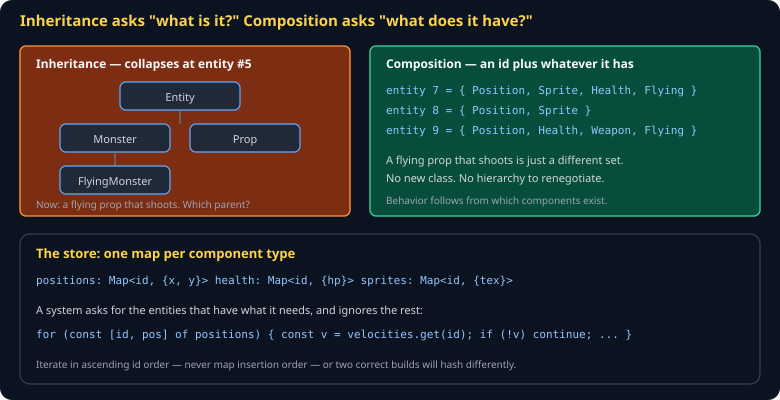
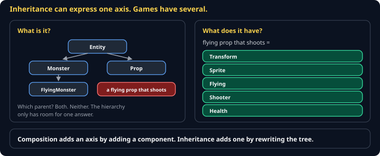
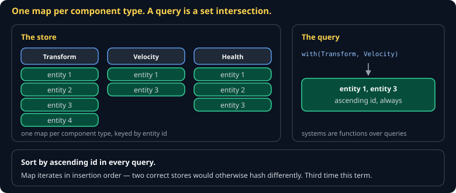

# Entity and Component Store Cheat Sheet (80/20)

Why every shipping engine composes entities instead of subclassing them, and the smallest store that works. Skips archetype-based ECS and structure-of-arrays layouts — you need those at 100,000 entities, not 1,000.

Companion to [`game-programming-patterns`](game-programming-patterns.md). Specified in `spec/S05-entity-and-component-store.md`.



## The problem



You have `Monster` and `Prop`. Then you need a flying monster, so `FlyingMonster extends Monster`. Then a flying prop. Then a prop that shoots. Every new combination forces a hierarchy decision, and the hierarchy can only express one axis at a time.

> **An entity is an id. Components are data attached to that id. Behavior comes from which components an entity has.**

There is no `Player` class. There is entity 3, which happens to have `Position`, `Sprite`, `Health`, and `PlayerControlled`.

## The smallest store that works

```js
export class World {
  #nextId = 1;
  positions = new Map();   // id -> {x, y}
  velocities = new Map();  // id -> {dx, dy}
  health = new Map();      // id -> {hp, max}

  spawn(components) {
    const id = this.#nextId++;
    for (const [name, data] of Object.entries(components)) this[name].set(id, data);
    return id;
  }

  destroy(id) {
    for (const store of [this.positions, this.velocities, this.health]) store.delete(id);
  }

  *withAll(...names) {
    const ids = [...this[names[0]].keys()].sort((a, b) => a - b);   // ascending id, always
    for (const id of ids) {
      const parts = names.map((n) => this[n].get(id));
      if (parts.every(Boolean)) yield [id, ...parts];
    }
  }
}
```

One map per component type. `withAll` is the query. That is the whole idea.

## Systems



A system is a function that runs over entities having a particular set of components:

```js
export function movement(world) {
  for (const [id, pos, vel] of world.withAll('positions', 'velocities')) {
    pos.x += vel.dx;
    pos.y += vel.dy;
  }
}
```

Systems do not know about each other. They run in a fixed order each tick, and that order is part of your specification — swapping movement and collision changes the game.

> **Iterate in ascending id order, never map insertion order.** Two implementations storing entities in different containers must produce the same state hash, and `Map` iteration order is insertion order. This is one of the easiest determinism bugs to ship.

## Ids and the deletion trap

Deleting mid-iteration is the classic crash. Two fixes:

```js
// Defer: collect, then delete after the loop
const dead = [];
for (const [id, h] of world.withAll('health')) if (h.hp <= 0) dead.push(id);
for (const id of dead) world.destroy(id);
```

Never reuse ids. If entity 7 dies and a new entity becomes 7, any stale reference silently points at the wrong thing — and it will look like a physics bug for a day and a half.

## When to reach for more

You do not need an ECS library. You need one when profiling says you do:

| Symptom | What to try |
|---|---|
| Queries are slow at ~10k entities | Cache the query result, invalidate on spawn/destroy |
| Cache misses dominate | Structure-of-arrays instead of maps of objects |
| Systems fight over ordering | Make the order explicit and specified, not emergent |

At the scale of this course, `Map` is fine. Optimize when a budget fails.

## Common gotchas

- **A `GameObject` base class "just for shared stuff."** That is the hierarchy coming back in.
- **Components with methods.** Components are data. Behavior is systems. A component with a method becomes an object with an implicit update order.
- **Reusing ids.** See above. Never.
- **Mutating during iteration.** Defer deletions and spawns to the end of the tick.
- **A component nobody queries.** Dead weight in every hash and every save file.

## When you're stuck

- [Component pattern, Nystrom](https://gameprogrammingpatterns.com/component.html)
- `spec/S05-entity-and-component-store.md` — the class specification
- If a system needs data from another system mid-tick, you probably have an ordering problem rather than a storage problem. Write the order down.
