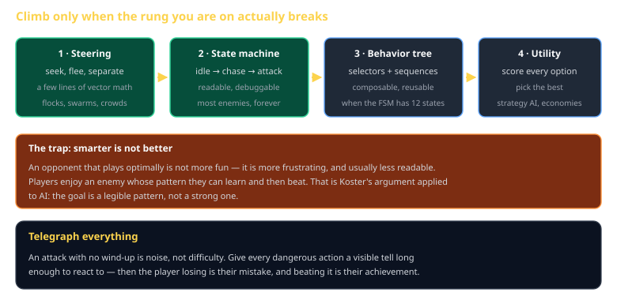
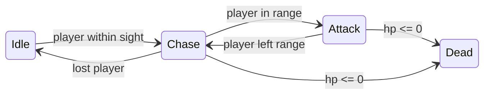

# Game AI and Behavior Cheat Sheet (80/20)

Steering, state machines, behavior trees, and utility scoring — in the order you should reach for them, with the reason most game AI should stay on the second rung. Skips GOAP, neural approaches, and full planners.

Companion to [`pathfinding-and-navigation`](pathfinding-and-navigation.md) and [`theory-of-fun`](theory-of-fun.md). Specified in `spec/S13-game-ai.md`.



## The trap, stated first

> **Smarter is not better.** An opponent that plays optimally is not more fun — it is frustrating and illegible.

Players enjoy an enemy whose pattern they can *learn* and then beat. That is Koster's argument applied to AI: you are building a legible pattern, not a strong one. Most "our AI is too dumb" complaints are really "our AI is not readable."

## Rung 1 — steering

Vector math, a few lines each, and enough for a surprising amount:

```js
const seek = (agent, target) => scale(normalize(sub(target, agent.pos)), agent.maxSpeed);
const flee = (agent, threat) => scale(seek(agent, threat), -1);

function separate(agent, neighbours, radius) {
  let push = { x: 0, y: 0 };
  for (const n of neighbours) {
    const away = sub(agent.pos, n.pos);
    const d = length(away);
    if (d > 0 && d < radius) push = add(push, scale(away, (radius - d) / d));
  }
  return push;
}
```

Sum the forces, clamp to `maxSpeed`. Flocks, crowds, and swarms are all this.

## Rung 2 — state machines

Where most enemies should live permanently:



```js
const transitions = {
  idle:   (e, w) => (canSee(e, w.player) ? 'chase' : 'idle'),
  chase:  (e, w) => (!canSee(e, w.player) ? 'idle' : inRange(e, w.player) ? 'attack' : 'chase'),
  attack: (e, w) => (inRange(e, w.player) ? 'attack' : 'chase'),
};
e.state = e.hp <= 0 ? 'dead' : transitions[e.state](e, world);
```

Readable, debuggable, and you can print the state. Its weakness is combinatorial: twelve states means up to 132 transitions to reason about.

## Rung 3 — behavior trees

When the FSM's transition table stops fitting in your head. A tree of **selectors** (try each child until one succeeds) and **sequences** (run each child until one fails):

```
Selector
├── Sequence: [hp < 30%]  → [find cover] → [retreat]
├── Sequence: [enemy near] → [attack]
└── Patrol
```

Priority is top to bottom, so "flee when hurt" naturally pre-empts "attack." The reusability is the real win — a `find cover` subtree serves every unit type.

## Rung 4 — utility

Score every option, take the highest. Good for strategy AI where there is no obvious priority order:

```js
const options = [
  { action: 'build_farm',    score: foodNeed * 0.8 + idleVillagers * 0.3 },
  { action: 'train_soldier', score: threatLevel * 0.9 + (pop < cap ? 0.2 : -1) },
  { action: 'research_age',  score: canAfford ? 0.5 + surplus * 0.4 : 0 },
];
options.sort((a, b) => b.score - a.score || a.action.localeCompare(b.action));
```

Note the tie-break on action name — equal scores must resolve deterministically or the AI diverges between builds.

## Perception and fairness

An AI that reads the full world state feels like a cheater, because it is one. Give it a perception layer:

- A sight radius and line-of-sight check
- A reaction delay — a few hundred milliseconds before it responds
- Rate-limited updates: re-evaluate every N ticks, not every tick

The delay is what makes an enemy feel like it *noticed* you rather than always having known.

## Telegraph everything

Every dangerous action needs a wind-up the player can see and react to. Without it, losing is noise. With it, losing is the player's mistake and winning is their achievement.

## Common gotchas

- **State machines that can be in two states.** A pile of booleans is not a state machine.
- **Re-evaluating every tick.** Both a performance problem and a behavioral one — the AI twitches between options.
- **Perfect information.** Feels like cheating because it is.
- **No tie-break in a utility score.** Non-deterministic AI, and it will not reproduce.
- **Steering forces that fight.** Seek plus separate plus avoid can sum to zero and freeze a unit. Weight them, then clamp.
- **AI that reads the renderer.** It lives in the simulation. If it needs a screen position, the seam has leaked.

## When you're stuck

- [Steering Behaviors, Reynolds](https://www.red3d.com/cwr/steer/) — the original paper, still the best
- `spec/S13-game-ai.md` — the class specification
- Print each agent's current state above its head. Most "the AI is broken" reports resolve in thirty seconds once the state is visible.
