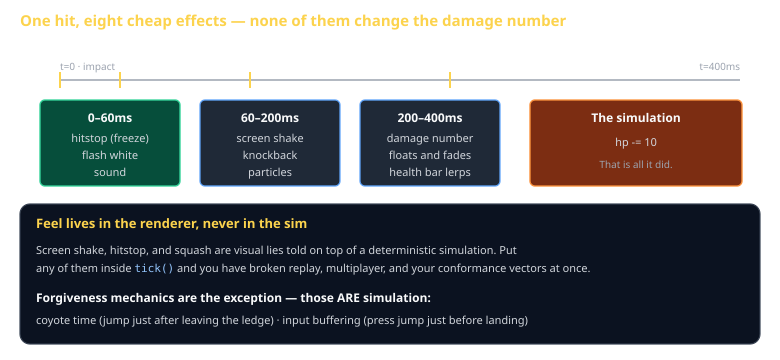
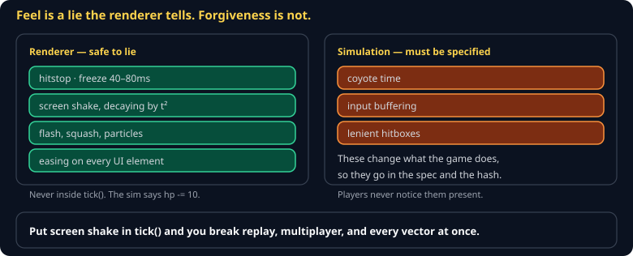

# Game Feel and Juice Cheat Sheet (80/20)

The cheap effects that make an action feel good, and the one architectural rule that keeps them from destroying your determinism. Skips animation blending and full particle systems — the list here costs a few lines each and buys most of the difference.

Companion to [`theory-of-fun`](theory-of-fun.md) and [`2d-rendering`](2d-rendering.md).



## The rule that comes first



> **Feel lives in the renderer. Never in the simulation.**

Screen shake, hitstop, and squash-and-stretch are visual lies told on top of a deterministic simulation. Put any of them inside `tick()` and you have broken replay, multiplayer, and your conformance vectors simultaneously.

The simulation says `hp -= 10`. Everything else is presentation.

## The list, roughly in order of value per line of code

**Hitstop.** Freeze rendering for 40–80ms on impact. Costs three lines, and it is the single largest contributor to a hit feeling like it landed.

```js
if (renderState.hitstopMs > 0) { renderState.hitstopMs -= elapsedMs; return; }
```

**Screen shake.** Random offset applied to the camera, decaying over ~200ms.

```js
const t = shake.remaining / shake.duration;
camera.offsetX = (rng.next() * 2 - 1) * shake.magnitude * t * t;
```

Decay by `t²` rather than `t` — linear decay reads as a wobble, quadratic as an impact. And use the *render* RNG, not the simulation's, or you have just made the sim depend on the frame rate.

**Flash.** Tint the struck sprite white for two frames.

**Knockback.** A brief velocity impulse away from the hit. This one *is* simulation.

**Easing.** Never move a UI element linearly. `easeOutCubic` on a health bar makes it feel physical:

```js
const easeOutCubic = (t) => 1 - Math.pow(1 - t, 3);
```

**Squash and stretch.** Scale non-uniformly on landing — `scaleY = 0.8, scaleX = 1.2` — recovering over ~120ms.

**Particles.** Even eight coloured squares that fly apart and fade is enough.

**Sound.** A hit with no sound feels broken in a way players cannot articulate. Vary the pitch ±10% so repeats do not become a machine gun.

## Forgiveness mechanics — these are simulation

The exception to the rule above. These change what the game *does*, so they belong in `tick()` and must be specified:

| Mechanic | What it does |
|---|---|
| **Coyote time** | Jump still works for ~100ms after walking off a ledge |
| **Input buffering** | A jump pressed ~150ms before landing fires on landing |
| **Lenient hitboxes** | The player's hurtbox is smaller than their sprite; enemy hurtboxes are larger |

Players never notice these and universally notice their absence. The game feels "tight" or "unresponsive" and nobody can say why.

## Telegraphing

Feel is not only reward — it is warning. An attack needs a wind-up long enough to react to, or losing to it is noise rather than difficulty. See [`theory-of-fun`](theory-of-fun.md): if the player cannot say *why* they died, no amount of juice will save it.

## Common gotchas

- **Screen shake in the simulation** — breaks determinism and makes everyone motion sick. Renderer only, and give players a slider.
- **Effects that outlast their cause** — a two-second shake on a light hit reads as a bug.
- **Hitstop on every hit in a fast game** — reserve it for meaningful impacts or the game feels like it is stuttering.
- **Linear easing everywhere** — the most common reason UI feels cheap.
- **Simulation RNG in a visual effect** — a rendered effect must never advance the sim's generator, or frame rate changes the game.

## When you're stuck

- [Juice it or lose it](https://www.youtube.com/watch?v=Fy0aCDmgnxg) — Grapefrukt, twelve minutes, the canonical demo
- Steve Swink, *Game Feel* — the book-length treatment
- Record thirty seconds of your game and a game you admire. Play them side by side with sound off. The gap is almost always in this list.
