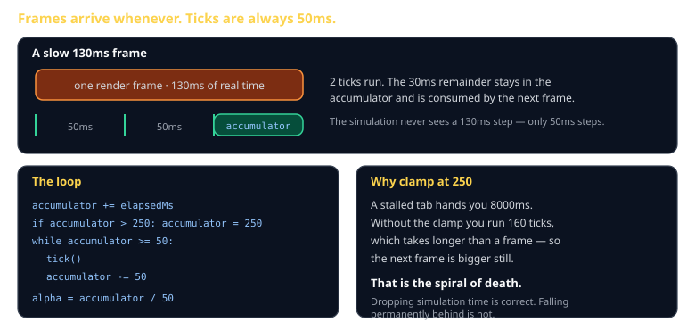
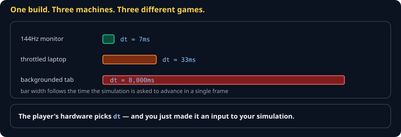
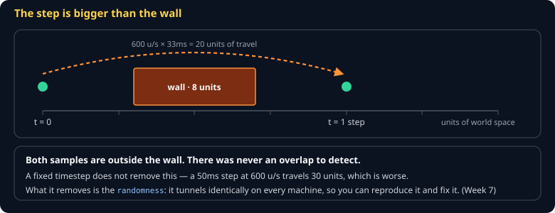
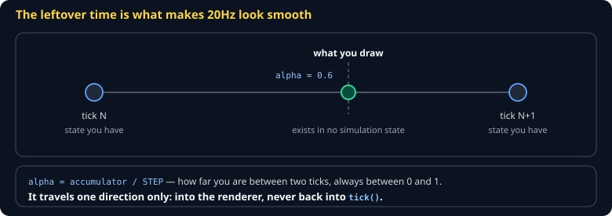
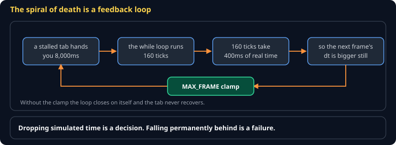
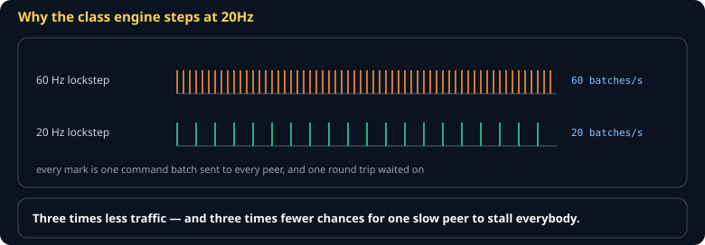

# Game Loop and Time Cheat Sheet (80/20)

Why your game must not use the frame time as its timestep, and the fifteen lines that fix it. Covers the fixed-timestep accumulator, interpolation alpha, and the spiral of death — skips variable-timestep integration and multithreaded loops, which you will not need this term.

Companion to [`determinism-and-replay`](determinism-and-replay.md). Specified in `spec/S01-time-and-loop.md`.



## The bug you are avoiding



A fast body can also step straight over a wall without ever overlapping it:



A fixed timestep does **not** remove tunnelling — a 50ms step at 600 u/s travels 30 units, which is worse. What it removes is the randomness: it tunnels identically everywhere, which is what makes it reproducible and fixable (see [`collision-and-spatial-partition`](collision-and-spatial-partition.md)).

The obvious loop is wrong:

```js
// WRONG — physics now depends on your frame rate
function frame(dtMs) {
  player.x += player.vx * dtMs;
  render();
}
```

On a 144Hz monitor `dtMs` is ~7. On a struggling laptop it is ~33. Same code, different game: jumps reach different heights, collisions tunnel at low frame rates, and no two players ever see the same thing. Replay and multiplayer are impossible, because the simulation depends on hardware.

## The fix

Separate **when the simulation advances** from **when you draw**.

```js
const STEP_MS = 50;        // 20Hz simulation
const MAX_ACCUM_MS = 250;  // clamp: at most 5 steps per frame
let accumulator = 0;

function frame(elapsedMs) {
  accumulator = Math.min(accumulator + elapsedMs, MAX_ACCUM_MS);

  while (accumulator >= STEP_MS) {
    sim.tick();              // always exactly 50ms of simulated time
    accumulator -= STEP_MS;
  }

  render(accumulator / STEP_MS);   // alpha in [0, 1)
}
```

> **`tick()` takes no time argument.** That is the point. A step is always 50ms, so the simulation has no way to depend on frame pacing. If your `tick` needs a delta, the separation has already leaked.

## Interpolation alpha



Between ticks the world is frozen, so rendering at 144Hz would look like 20Hz. The remainder in the accumulator tells you how far *between* two ticks you are:

```js
function render(alpha) {
  const x = prev.x + (curr.x - prev.x) * alpha;
  drawSprite(x);
}
```

Keep the previous position each tick; interpolate for drawing only.

> **Alpha goes into the renderer and never comes back.** If the simulation reads alpha, it now depends on frame rate again, and you have undone the whole thing.

## The spiral of death



If one frame delivers more time than the simulation can consume, you run many ticks, which takes longer than a frame, which makes the next frame's elapsed time bigger. It never recovers.

Clamping the accumulator is the fix. At 250ms you run at most five steps, and a stalled tab resumes by **dropping simulated time** rather than trying to catch up forever. Dropping time is correct behavior; falling permanently behind is not.

## Choosing a step size



| Step | Rate | Fits |
|---|---|---|
| 16.6ms | 60Hz | action, platformers, anything with precise collision |
| 33ms | 30Hz | most 3D games |
| **50ms** | **20Hz** | **strategy, this course** — fewer commands to send over the network |

20Hz is the class default because it makes lockstep multiplayer cheap: twenty command batches per second instead of sixty.

## Common gotchas

- **Using `Date.now()` inside `tick()`** — the simulation now depends on the wall clock and cannot replay. Time comes from the tick count, nothing else.
- **`requestAnimationFrame` delta on the first frame** — often huge or zero. Clamp before using it.
- **Forgetting to store the previous position** — no interpolation is possible, and 20Hz looks like 20Hz.
- **Accumulating in seconds as a float** — repeated `+= 0.0166` drifts. Accumulate integer milliseconds.
- **Rendering inside the `while` loop** — you draw five times for one frame and wonder why it is slow.

## When you're stuck

- [Fix Your Timestep!](https://gafferongames.com/post/fix_your_timestep/) — Glenn Fiedler, the canonical article
- `spec/S01-time-and-loop.md` — the class specification and its conformance vector
- Print `ticks` and `accumulator` each frame. If ticks per second is not steady at 20, the loop is wrong before anything else can be right.
