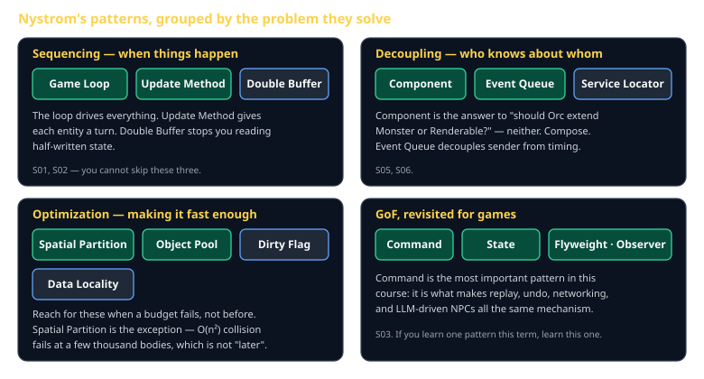
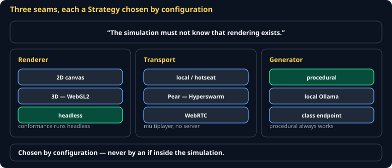
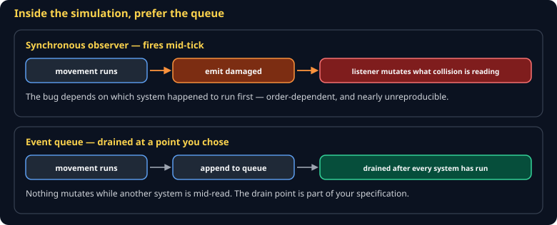
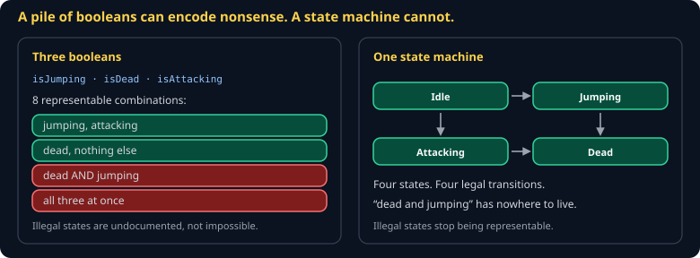
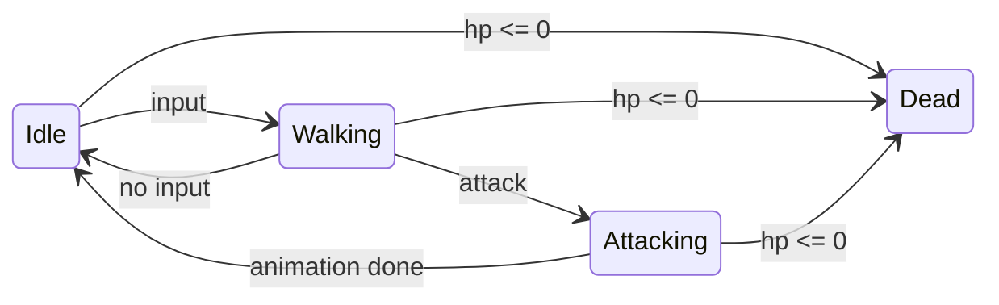

# Game Programming Patterns Cheat Sheet (80/20)

The vocabulary of engine architecture, in the eight patterns you will use this term and the eleven you should recognize. Robert Nystrom's book is free online and better than this sheet; this is the map and the argument for which ones matter first.

Companion to [`entity-component-store`](entity-component-store.md) and [`determinism-and-replay`](determinism-and-replay.md).



## The eight you will actually type



### Command — the one that matters most

Wrap an action in an object instead of calling it directly.

```js
// instead of: if (key === 'W') player.moveUp();
const command = { tick: 42, kind: 'move', args: { dx: 0, dy: -1 } };
```

Why it dominates this course: once actions are data, **replay, undo, networking, AI, and LLM-driven NPCs become the same mechanism.** A remote player sends commands. A recorded game is a list of commands. An NPC is something that produces commands. You build one path and get five features.

### Game Loop and Update Method

The loop decides *when* the world advances; Update Method gives each entity its turn within a step. Together they are the spine — see [`game-loop-and-time`](game-loop-and-time.md).

### Component

The answer to "should `Orc` extend `Monster` or `Renderable`?" is **neither**. An entity is an id with components attached: `Position`, `Health`, `Sprite`. Behavior comes from which components an entity has, not from where it sits in a hierarchy.

The deep-inheritance version works for about four entity types and then collapses. Every engine that ships uses composition.

### Observer and Event Queue



Observer: "tell me when X happens." Event Queue: "tell me *later*, in tick order."

Prefer the queue in a simulation. A synchronous observer fires mid-tick, so a listener can mutate state another system is halfway through reading — and the resulting bug is order-dependent and nearly unreproducible.

### State



A character is idle, or walking, or attacking — and the legal transitions are a small graph. Writing that graph explicitly beats a pile of booleans that can encode `isJumping && isDead`.



### Spatial Partition

Checking every pair is O(n²): fine at 100 bodies, hopeless at 5,000. Bucket objects by location and check only neighbours. This is the one optimization pattern you need *before* profiling, because the naive version fails at a scale you will hit this term.

### Object Pool

Allocating a bullet per shot makes the garbage collector pause your frame. Keep a pool of dead bullets and reuse them. Reach for this when you see periodic frame spikes, not before.

### Flyweight

A thousand trees share one mesh and one texture; only their transforms differ. Split what varies per instance from what is common to the type.

## The eleven to recognize

| Pattern | One line |
|---|---|
| Double Buffer | Write to a back buffer, swap — nobody reads half-written state |
| Dirty Flag | Recompute only what changed since last frame |
| Data Locality | Arrange memory so the cache is not the bottleneck |
| Service Locator | Global access without a global variable |
| Type Object | Define entity *types* in data instead of code |
| Subclass Sandbox | A base class offers safe operations; subclasses compose them |
| Bytecode | Data-driven behavior when config is not expressive enough |
| Prototype | Clone a configured instance instead of constructing |
| Singleton | Usually a mistake in games. Nystrom says so too. |

## Choosing between them

- **"Should this be a component or a subclass?"** — component, essentially always.
- **"Observer or event queue?"** — queue in the simulation, observer in the UI.
- **"Do I need object pooling?"** — only after a profiler shows GC pauses.
- **"Do I need a spatial partition?"** — yes, if you have more than a few hundred colliders.
- **"Should this be a singleton?"** — no. Pass it in.

## Common gotchas

- **Applying every pattern.** A pattern is a solution to a problem you have. Nine patterns in a 500-line game is nine problems you invented.
- **Command objects that hold references to live state** — they stop being replayable data and become closures over a world that has moved on.
- **A state machine with implicit transitions** — if a transition is not in the graph, it should be impossible, not merely undocumented.
- **Pooling before profiling** — reused-object bugs are far worse than the GC pause you were avoiding.
- **Component soup** — twelve components per entity with implicit ordering dependencies is inheritance with extra steps.

## When you're stuck

- [Game Programming Patterns](https://gameprogrammingpatterns.com/) — Robert Nystrom, free online, the canonical text
- `spec/S03-command-model.md` — Command as this course applies it
- When a design feels tangled, ask which of these four problems you have: sequencing, decoupling, optimization, or type modeling. The group narrows the answer fast.
