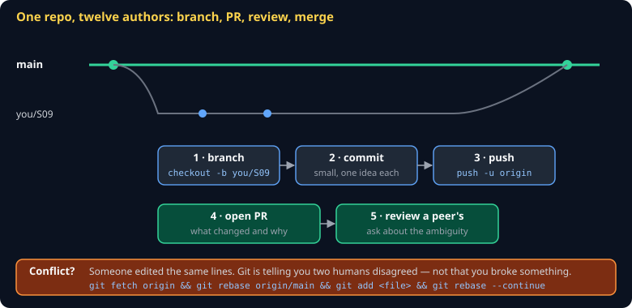

# Git Collaboration Cheat Sheet (80/20)

The 20% of git you need to work in a repository other people are also writing to. Covers branch, pull request, review, and merge conflict — and skips `bisect`, `reflog`, submodules, and rewriting published history, which you will meet when you need them.

Companion to the class engine spec repo, which is where you will use every command here.



## The one idea

In a solo repo you commit to `main` and never think about it. In a shared repo, `main` is a **published, shared history** — everyone builds on it, so it must always work.

> **Never commit directly to `main` in a shared repo.** Your branch is a private draft. `main` is the published edition. A PR is how a draft becomes published, and review is the only step that catches what you could not see yourself.

## The loop

```bash
git checkout main && git pull          # start from what everyone else has
git checkout -b hunterino/S09          # your name, your section
# ...edit...
git add spec/S09-renderer.md
git commit -m "spec(S09): pin the sprite batching order"
git push -u origin hunterino/S09
gh pr create --fill                    # or open it in the browser
```

Branch names: `<your-username>/<what>`. The username prefix means twelve people can have a `fix` branch without colliding.

## Commits

One commit, one idea. A commit that says "stuff" is a commit nobody can revert safely.

```bash
git add -p        # stage hunk by hunter — the fastest way to split a messy change
git commit        # opens an editor: subject line, blank line, body
```

The subject line finishes the sentence *"applying this commit will…"*. `spec(S09): pin the sprite batching order` — not `updated spec`.

## Reviewing someone else's PR

You are not looking for typos. You are looking for **the thing you would have implemented differently** — because in this course, that difference is the measurement.

Good review comments on a spec section:

- "Does 'sorted' mean ascending by id, or insertion order? I would have picked insertion."
- "What happens at exactly zero? The prose says 'positive' but the vector uses `>=`."
- "This says round — round which way? S00 says half away from zero."

Each of those is a divergence you prevented before a build had to find it.

## Merge conflicts

A conflict means two people edited the same lines. Git will not guess which one is right, so it hands both to you:

```
<<<<<<< HEAD
the version already on main
=======
your version
>>>>>>> hunterino/S09
```

Delete the markers, leave the text that should survive — often a merge of both, not one or the other — then:

```bash
git add <file>
git rebase --continue
git push --force-with-lease
```

> **Use `--force-with-lease`, never `--force`.** `--force` overwrites whatever is on the remote, including a commit a teammate pushed thirty seconds ago. `--force-with-lease` refuses if the remote moved since you last fetched. Same keystrokes, one of them cannot destroy someone else's work.

## Rebase vs. merge, in one table

| | What it does | Use when |
|---|---|---|
| `git rebase origin/main` | Replays your commits on top of current `main` | Updating **your own unmerged branch**. Keeps history linear. |
| `git merge origin/main` | Creates a merge commit joining both | You have already shared the branch and someone else is building on it |

For this course: rebase your own branch, always.

## Common gotchas

- **Committed to `main` by accident** — `git branch hunterino/fix && git reset --hard origin/main`. Your work is on the new branch; `main` is clean.
- **Pushed a secret** — rotate the key first, immediately. Removing the commit does not un-publish it; anyone could already have fetched.
- **"Everything is a conflict"** — you probably merged instead of rebasing, or your editor changed line endings. Check `git diff --stat` before panicking.
- **`--force` after a rejected push** — a rejection means the remote moved. Fetch and look before you overwrite.
- **Giant PR nobody reviews** — a 40-file PR gets a rubber stamp, which is the same as no review. Split it.

## When you're stuck

- [Pro Git, chapters 2–3](https://git-scm.com/book/en/v2) — the canonical free reference
- [Learn Git Branching](https://learngitbranching.js.org/) — visual, interactive, twenty minutes
- `git reflog` — every commit you have had checked out, including ones you think you destroyed. Almost nothing in git is truly lost for 30 days.
