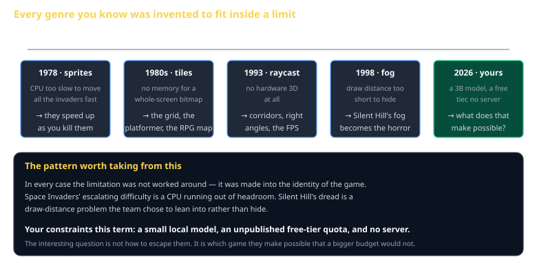
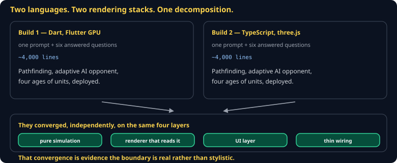

# History of Games Cheat Sheet (80/20)

Not a timeline to memorize — a set of moments where a technical limitation became a design identity, and why that pattern is the most useful thing history offers you. Written as the reference for the *My Favorite Game* talk.

Companion to [`theory-of-fun`](theory-of-fun.md) and [`mda-framework`](mda-framework.md).

## The pattern

> **The limitation was not worked around. It became the game.**

**Space Invaders (1978).** The CPU could not move all the invaders at full speed. As you destroyed them, the remaining ones sped up — because there were fewer to draw. Nobody designed escalating difficulty; the hardware did, and Nishikado kept it.

**Tile maps (1980s).** There was not enough memory for a full-screen bitmap, so the screen was assembled from a small set of reused tiles. That constraint produced the grid, and the grid produced the platformer, the top-down RPG, and the dungeon crawler.

**Doom (1993).** No hardware 3D existed. Carmack's raycasting could not do sloped floors or rooms above rooms — so Doom is corridors and right angles, and the first-person shooter's spatial vocabulary was set by a rendering shortcut.

**Silent Hill (1998).** The PlayStation could not draw far. Rather than hide it, the team filled the town with fog and made not-seeing the source of the horror. It remains the most-cited example of a limitation converted directly into atmosphere.

**Roguelikes.** No memory for hand-authored levels, so generate them. That constraint produced permadeath, procedural generation, and eventually a genre that outlived the limitation entirely.

## Why this matters to you now

Your constraints this term are real and specific: a **1–4B local model**, an **unpublished free-tier quota**, **no server**, and **no budget for generated video**.

The unproductive response is to treat each as an obstacle to route around. The productive one is the question this history keeps answering:

> **Which game do these constraints make possible that a bigger budget would not?**

A game designed around an NPC that sometimes cannot reach its model is a different game from one where it always can — and possibly a better one. A peer-to-peer game with no authoritative server has a texture that a client-server game does not.

## Eras, briefly

Enough scaffolding to place a game you are researching.

| Era | Defining constraint | What it produced |
|---|---|---|
| **Arcade** (1971–83) | The quarter. Sessions must be short and end. | Escalating difficulty, high scores, instant restart |
| **Console 8/16-bit** (1983–94) | Cartridge size, no saving | Tile maps, password systems, precision platforming |
| **Early 3D** (1994–2000) | No hardware 3D, then barely any | Fixed cameras, fog, corridor design, tank controls |
| **Online** (2000–10) | Latency and dial-up | Lockstep RTS, client prediction, MMO subscriptions |
| **Indie/digital** (2008–) | Distribution became free | Genre revival, experimentation, one-person teams |
| **Now** (2023–) | Generation is cheap; attention is not | Still being decided — by you, among others |

## For your talk

The rubric asks for *why it works* and *the technical how*. The strongest talks connect them:

1. **Name the constraint** the developers faced — hardware, budget, team size, platform.
2. **Show the design decision** that came out of it.
3. **Explain the mechanism** — how it actually worked, at the level of the code.
4. **Say what you are stealing.** What does this let you do in your own project?

"Space Invaders is fun" is a review. "Space Invaders' difficulty curve is an accident of sprite-drawing cost, kept because it felt right, and here is what that suggests about tuning by feel rather than by spreadsheet" is a talk.

## Common gotchas

- **A timeline instead of an argument.** Dates are not insight.
- **Nostalgia as analysis.** "It was amazing at the time" tells the class nothing they can use.
- **Skipping the technical half.** The rubric weights it at 35 points.
- **Choosing a game you have not played recently.** Memory reconstructs games as better and simpler than they were.

## When you're stuck

- [The Digital Antiquarian](https://www.filfre.net/) — long-form, technically literate game history
- Ars Technica's *War Stories* series — developers explaining the specific constraint they fought
- Play the actual game, not a remaster. The original constraints are the subject.
