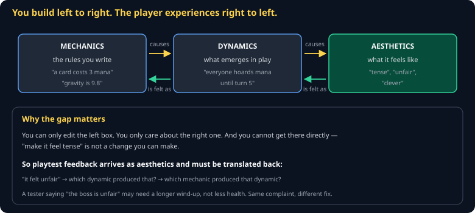

# MDA Framework Cheat Sheet (80/20)

Mechanics, Dynamics, Aesthetics — the vocabulary for saying precisely what is wrong with a game instead of "it's not fun." Twenty minutes of theory that makes playtest feedback actionable.

Companion to [`theory-of-fun`](theory-of-fun.md) and [`playtesting`](playtesting.md).



## The three layers

| Layer | What it is | Example |
|---|---|---|
| **Mechanics** | The rules, as written in code | "A card costs 3 mana. You gain 1 mana per turn." |
| **Dynamics** | What emerges when people play | "Nobody plays anything before turn 5." |
| **Aesthetics** | What it feels like | "The early game is boring." |

## The asymmetry

> **You can only edit mechanics. You only care about aesthetics. Dynamics is the gap, and it is where all the surprises live.**

You cannot implement "tense." You implement a mana curve and *hope* tense comes out. This is why games need playtesting in a way that most software does not: the thing you care about is two causal steps away from the thing you control.

## Translating feedback

Playtest feedback always arrives as aesthetics. Your job is to walk it back:

```
"The boss is unfair"                          ← aesthetic
   ↓ which dynamic caused that?
"I die before I can react to the slam"        ← dynamic
   ↓ which mechanic caused that?
"Wind-up is 8 frames"                         ← mechanic — now you can edit something
```

Note that the obvious fix — reduce boss health — would not have touched the actual problem. Same complaint, entirely different repair.

## Aesthetics worth naming

The MDA paper lists eight. These are the ones that come up most:

| Aesthetic | Player is here for |
|---|---|
| **Challenge** | An obstacle course |
| **Fellowship** | Other people |
| **Discovery** | Uncharted territory |
| **Expression** | Making something their own |
| **Narrative** | A drama unfolding |
| **Sensation** | How it looks, sounds, and feels |

Naming your target changes your decisions. A game built for Discovery should not label everything on the map. A game built for Challenge should not be forgiving.

## Using it on your own game

Fill this in for your project — it takes ten minutes and prevents a term of drift:

```
Aesthetic I am aiming for: _______
Dynamic that would produce it: _______
Mechanic that would produce that dynamic: _______
```

Then playtest and check whether the dynamic you predicted actually appears. It usually does not, and the gap is the most useful information you will get all week.

## Where MDA is weak

It is a diagnostic vocabulary, not a design method. It tells you how to *talk* about a problem, not how to solve one, and the eight aesthetics are a rough taxonomy rather than a theory. Use it to structure feedback; do not expect it to generate designs.

## Common gotchas

- **Treating aesthetics as a fix.** "Make it more fun" is a restatement of the problem.
- **Fixing the mechanic named by the tester.** Players propose solutions; take their *observation*, not their patch.
- **Assuming your dynamic will emerge.** It usually will not. That is what playtesting is for.
- **Designing for every aesthetic at once.** A game that wants to be tense, relaxing, competitive, and expressive is four games fighting.

## When you're stuck

- [MDA: A Formal Approach to Game Design](https://users.cs.northwestern.edu/~hunicke/MDA.pdf) — Hunicke, LeBlanc, Zubek. Eight pages.
- [`playtesting`](playtesting.md) — how to gather the observations this framework translates
- When a teammate says a change "feels wrong," ask which of the three layers they are describing. It resolves most design arguments in a sentence.
