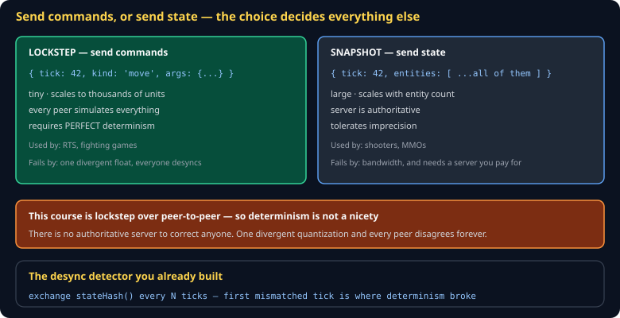

# Netcode Cheat Sheet (80/20)

The one architectural choice that determines everything else — commands or state — plus the latency-hiding techniques each requires. Skips rollback implementation details and interest management.

Companion to [`determinism-and-replay`](determinism-and-replay.md) and [`p2p-pear-holepunch`](p2p-pear-holepunch.md). Specified in `spec/S17-transport.md`.



## The fork in the road

| | **Lockstep** | **Snapshot** |
|---|---|---|
| Sends | commands | world state |
| Bandwidth | tiny, constant | scales with entities |
| Needs | perfect determinism | an authoritative server |
| Scales to | thousands of units | dozens of players |
| Used by | RTS, fighting games | shooters, MMOs |

**This course is lockstep over peer-to-peer.** Which means determinism stops being a good practice and becomes a hard requirement: there is no server to correct anyone, so one divergent quantization and every peer disagrees forever.

## Lockstep

Every peer runs the same simulation and exchanges only inputs:

```js
// each tick: broadcast my commands for tick N + delay
transport.send({ tick: currentTick + INPUT_DELAY, commands: myCommands });

// advance only when every peer's commands for this tick have arrived
if (haveAllCommandsFor(currentTick)) {
  for (const c of sortedCommands(currentTick)) sim.apply(c);
  sim.tick();
  currentTick++;
}
```

Two details carry the whole thing:

**Input delay.** Commands are scheduled two or three ticks in the future so they arrive before they are needed. At 20Hz, three ticks is 150ms of hidden latency — which is why RTS games feel slightly sluggish and why that is a deliberate trade.

**Sorted commands.** Every peer must apply the same commands in the same order. Sort by `(tick, peerId, sequence)` — never by arrival order, which differs per peer by definition.

## Desync detection

You already have the tool:

```js
if (tick % 30 === 0) transport.send({ kind: 'hash', tick, hash: sim.stateHash() });

function onPeerHash({ tick, hash }) {
  if (myHashAt(tick) !== hash) {
    console.error(`DESYNC at tick ${tick}`);   // the first mismatch is where it broke
    halt();
  }
}
```

Halting on desync is better than continuing. Two peers playing different games while both believe they are winning is a worse experience than an honest error.

## Snapshot, and the techniques it needs

If you go the other way, three techniques hide latency:

**Interpolation** — render remote entities ~100ms in the past, between two received snapshots. Smooth, at the cost of seeing everyone slightly late.

**Client-side prediction** — apply your own input immediately rather than waiting for the server. Your character responds instantly.

**Server reconciliation** — when the authoritative state arrives, rewind to it, replay your unacknowledged inputs, and see whether you end up where you predicted. If yes, nothing visible happens. If no, you snap — and that snap is the "rubber-banding" players complain about.

## What P2P lockstep gives up

**Anti-cheat.** With no authority, a modified peer can lie, and you can only *detect* divergence, not prevent it. That is a real trade and worth stating plainly rather than discovering in December.

It is also the best possible demonstration of *why* authoritative servers exist — you learn what they buy by working without one.

## Common gotchas

- **Applying commands in arrival order.** Guaranteed desync.
- **Floats in the state hash.** Quantize first. See [`determinism-and-replay`](determinism-and-replay.md).
- **`Math.random()` anywhere in the sim.** Instant divergence.
- **No input delay.** Peers stall waiting for commands that have not arrived.
- **Continuing after a desync.** Both players think they are winning different games.
- **Testing only on localhost.** Zero latency hides every timing bug you have.

## When you're stuck

- [Gaffer On Games — networking](https://gafferongames.com/categories/game-networking/) — the standard reference
- [Overwatch's netcode GDC talk](https://www.youtube.com/watch?v=W3aieHjyNvw) — the clearest explanation of prediction and reconciliation
- On desync, log the state hash every tick on both peers and diff. The first differing tick names the subsystem.
