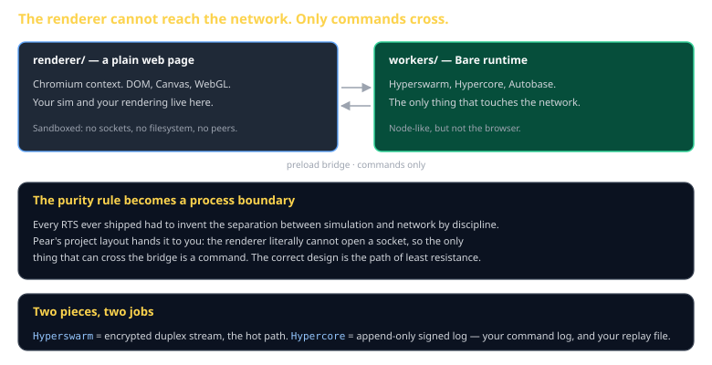

# Pear and Holepunch Cheat Sheet (80/20)

Peer-to-peer multiplayer with no server: how peers find each other, which primitive to use for the hot path, and why Pear's project layout enforces the architecture this course teaches. Skips Autobase multi-writer resolution and Hyperdrive internals.

Companion to [`netcode`](netcode.md) and [`determinism-and-replay`](determinism-and-replay.md). Specified in `spec/S17-transport.md`.



## Why this stack

Multiplayer normally needs a server you rent, secure, and keep running. Holepunch's stack does not: peers find each other through a distributed hash table and connect directly, with NAT hole-punching handled for you.

Cost: **zero**. That is not a minor detail in a course where every other resource is free by design.

## The pieces

| Piece | What it is | Use it for |
|---|---|---|
| **Hyperswarm** | topic-based discovery + encrypted duplex streams | the hot path — commands every tick |
| **Hypercore** | append-only, signed, replicated log | the durable command log, and your replay file |
| **Hyperbee** | key-value store on Hypercore | lobby and profile data |
| **Hyperdrive** | P2P filesystem | distributing large generated assets |
| **Bare** | the JS runtime underneath | where worker code runs |

## Connecting

```js
import Hyperswarm from 'hyperswarm';
import crypto from 'hypercore-crypto';

const swarm = new Hyperswarm();
const topic = crypto.data(Buffer.from('cs3540-my-game-lobby-01'));

swarm.join(topic, { server: true, client: true });
await swarm.flush();          // announced and connected to what exists

swarm.on('connection', (socket, info) => {
  socket.on('data', (buf) => onPeerCommands(JSON.parse(buf.toString())));
  peers.add(socket);
});
```

A topic is a 32-byte key — any two peers deriving the same key find each other. Derive it from a lobby code so players can share a short string.

## The architectural gift

A Pear desktop app has two halves:

```
renderer/    a plain web page — Chromium, DOM, Canvas, WebGL
    ↕        preload bridge
workers/     Bare — Hyperswarm, Hypercore
```

The renderer is **sandboxed**. It cannot open a socket. The only thing that can cross the bridge is whatever you pass through it — which, in a well-built game, is commands.

> **Every RTS ever shipped had to invent the simulation/network separation by discipline. Pear's default project layout makes it a process boundary.** The correct design becomes the path of least resistance.

## Hypercore as the command log

The match log *is* a hypercore: append-only, ordered, cryptographically signed. Which means you get things you would otherwise build:

- **Replays** — the log is the replay file, no export step
- **Provenance** — signatures prove which peer issued which command
- **Late join and resync** — a peer replicates the log and replays from the start

## Your model does not know this stack

Claude knows three.js deeply and Holepunch shallowly. You will get hallucinated APIs.

This is deliberate on the course's part — it is the one place where the model is out of its depth, and working anyway is the actual skill. The tools for it are Pillars 1, 3, and 5:

- Put the **real API surface** in `CLAUDE.md`, copied from the docs
- Write a **skill** encoding the join-and-connect pattern once you have it working
- Point an **MCP** docs server at the Holepunch documentation

When a suggested method does not exist, that is the expected case, not a failure. Check the docs, correct the context, move on.

## Common gotchas

- **Not awaiting `swarm.flush()`.** You join and immediately look for peers who have not been told you exist.
- **Testing on one machine.** Two processes on localhost never exercise hole-punching. Use two machines, on the network you will demo on.
- **Restrictive networks.** Some corporate and campus networks defeat the DHT. Test in the room you will present in, well before you present.
- **Hypercore replication for the hot path.** It is designed for durable data, not 20Hz input. Use a Hyperswarm stream for commands.
- **Assuming ordered delivery across peers.** Sort by `(tick, peerId)` yourself.
- **Shipping a credential in the app.** P2P distribution is irrevocable — anything embedded is published.

## When you're stuck

- [docs.pears.com](https://docs.pears.com/) — the authoritative reference. Read it directly; do not trust recall.
- `spec/S17-transport.md` — the class specification, and the `LocalTransport` you can develop against without any network
- Build against `LocalTransport` first. If your game only works when networked, you cannot debug it.
