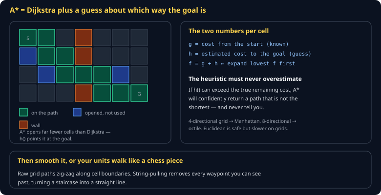
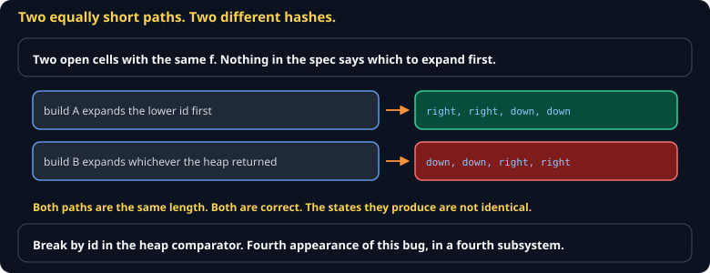

# Pathfinding and Navigation Cheat Sheet (80/20)

A\* on a grid, the heuristic rule that makes it correct, string-pulling so units do not walk like chess pieces, and local avoidance so they do not stack. Skips navmesh generation, hierarchical pathfinding, and flow fields.

Companion to [`game-ai-behavior`](game-ai-behavior.md) and [`collision-and-spatial-partition`](collision-and-spatial-partition.md). Specified in `spec/S12-pathfinding.md`.



## A\* in one idea

Dijkstra explores outward in every direction. A\* explores toward the goal, because each cell carries a guess about how far is left.

```
g = cost from start to this cell        (known)
h = estimated cost from here to goal    (guess)
f = g + h                               (expand lowest f first)
```

## The implementation



```js
export function findPath(grid, start, goal) {
  const open = new MinHeap((a, b) => a.f - b.f || a.id - b.id);   // id tie-break: determinism
  const gScore = new Map([[key(start), 0]]);
  const cameFrom = new Map();
  open.push({ ...start, f: heuristic(start, goal), id: key(start) });

  while (!open.isEmpty()) {
    const current = open.pop();
    if (key(current) === key(goal)) return reconstruct(cameFrom, current);

    for (const n of neighbours(grid, current)) {
      const tentative = gScore.get(key(current)) + cost(current, n);
      if (tentative >= (gScore.get(key(n)) ?? Infinity)) continue;
      cameFrom.set(key(n), current);
      gScore.set(key(n), tentative);
      open.push({ ...n, f: tentative + heuristic(n, goal), id: key(n) });
    }
  }
  return null;    // no path — handle it, do not assume one exists
}
```

> **The `a.id` tie-break in the heap comparator is not optional here.** When two cells have equal `f`, an unspecified order means two correct implementations return different — equally short — paths, and their state hashes diverge. Every tie in a deterministic simulation must be broken explicitly.

## The heuristic rule

> **`h` must never overestimate the true remaining cost.** Otherwise A\* returns a path that is not the shortest and gives you no indication.

| Movement | Heuristic |
|---|---|
| 4-directional | Manhattan: `|dx| + |dy|` |
| 8-directional | Octile: `max + 0.414 × min` |
| Any angle | Euclidean — always safe, sometimes slower |

Using Euclidean on a 4-directional grid is *safe* but explores more cells than necessary. Using Manhattan on an 8-directional grid **overestimates** and is wrong.

## String-pulling

A raw grid path zig-zags along cell boundaries. Remove every waypoint you can see past:

```js
export function smooth(path, isWalkable) {
  const out = [path[0]];
  let anchor = 0;
  for (let i = 2; i < path.length; i++) {
    if (!lineOfSight(path[anchor], path[i], isWalkable)) {
      out.push(path[i - 1]);
      anchor = i - 1;
    }
  }
  out.push(path[path.length - 1]);
  return out;
}
```

This one function is the difference between units that look like they are walking and units that look like they are solving a maze.

## Local avoidance

Pathfinding gets a unit to the destination; it does not stop ten units occupying the same tile. Add a separation force:

```js
for (const other of nearby(unit, radius)) {
  const away = sub(unit.pos, other.pos);
  const d = length(away);
  if (d > 0 && d < radius) unit.steering = add(unit.steering, scale(away, (radius - d) / d));
}
```

Path for the route, steering for the last two metres.

## Repathing

Recompute when the path is blocked, not every tick — A\* on a 96×96 grid for two hundred units every tick will eat your entire budget. Recompute on blockage, on a new order, or on a timer of several hundred milliseconds.

## Common gotchas

- **No tie-break in the heap.** Non-deterministic paths. See above.
- **Assuming a path exists.** `findPath` returns `null`. An unhandled `null` is a crash in the middle of combat.
- **Repathing every tick.** The most common performance failure in student RTS projects.
- **Diagonal movement through wall corners.** Check both orthogonal neighbours before allowing a diagonal.
- **Mutating the grid while pathing.** Path against a snapshot, or handle a mid-search change explicitly.

## When you're stuck

- [Amit Patel's A\* pages](https://theory.stanford.edu/~amitp/GameProgramming/) — the definitive reference, with interactive diagrams
- `spec/S12-pathfinding.md` — the class specification
- Render the open set and the final path. Almost every pathfinding bug is visible in one frame of that overlay.
