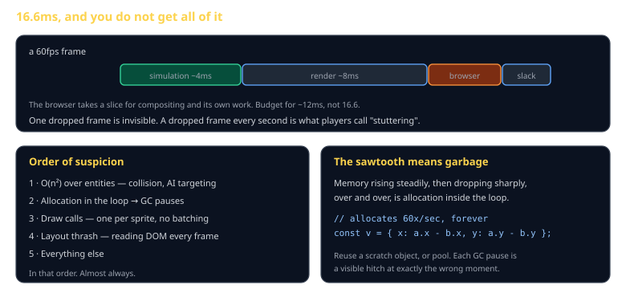

# Performance and Profiling Cheat Sheet (80/20)

How to find out why your game is slow instead of guessing, the frame budget you actually have, and the four causes that account for nearly all of it. Skips WebAssembly, worker threads, and GPU profiling.

Companion to [`collision-and-spatial-partition`](collision-and-spatial-partition.md) and [`2d-rendering`](2d-rendering.md).



## Measure first

> **You will guess wrong.** Everyone does. The bottleneck is almost never where it feels like it is.

```js
performance.mark('sim-start');
sim.tick();
performance.mark('sim-end');
performance.measure('sim', 'sim-start', 'sim-end');
```

Those marks appear in the Chrome performance panel's User Timing track, next to everything the browser is doing. Ten minutes of setup, and it ends the guessing permanently.

## The budget

60fps is 16.6ms per frame, but the browser takes a slice for compositing and its own work. **Budget ~12ms.**

At 20Hz simulation, a tick has 50ms of wall clock — but it must share with rendering, so keep it under ~4ms. A tick that occasionally takes 30ms is fine; one that always does will not survive five peers' commands arriving late.

One dropped frame is invisible. A dropped frame every second is what players call stuttering, and it is far more noticeable than a steady lower frame rate.

## The order of suspicion

**1 · O(n²) over entities.** Collision without a broadphase, AI targeting scanning all units, a "find nearest" inside a loop. This is the first thing to check and usually the answer. See [`collision-and-spatial-partition`](collision-and-spatial-partition.md).

**2 · Allocation in the loop.** Every `{ x, y }` created per entity per frame becomes garbage, and the collector pauses your frame to clean it up.

```js
// allocates 60 times a second, forever
const delta = { x: a.x - b.x, y: a.y - b.y };

// reuses one object
scratch.x = a.x - b.x; scratch.y = a.y - b.y;
```

The memory graph tells you: a **sawtooth** — rising steadily, dropping sharply, repeating — is allocation in the loop.

**3 · Draw calls.** One per sprite with no batching. See [`2d-rendering`](2d-rendering.md).

**4 · Layout thrash.** Reading a DOM property like `offsetWidth` after writing one forces a synchronous layout. Doing it per frame is expensive and invisible in your own code.

## Reading a flame chart

Wide bars are slow. That is most of the skill.

- **Wide `tick`** → your simulation. Go to the order of suspicion.
- **Wide `drawImage` / `drawElements`** → rendering. Batch or cull.
- **Wide "Minor GC" / "Major GC"** → allocation.
- **Wide "Recalculate Style" / "Layout"** → DOM work in the loop.
- **Wide gaps with nothing in them** → you are waiting on something. Usually a synchronous fetch or a await that should not be there.

Record ten seconds of actual gameplay, not the menu.

## Micro-optimizations that are not worth it

The modern JS engine is very good. Do not bother with:

- `for` versus `forEach` — negligible
- Caching `array.length` — the JIT does it
- Bit tricks instead of `Math.floor` — no
- `var` versus `let` — no

Do bother with: algorithmic complexity, allocation, and draw calls. Those are worth orders of magnitude; the list above is worth noise.

## Budgets, not vibes

State the target and test against it. The class engine's collision budget is **5,000 bodies at 60fps**, and it exists because a naive implementation passes every correctness test and fails that number.

```js
it('handles 5000 bodies within budget', () => {
  const bodies = makeBodies(5000);
  const start = performance.now();
  for (let i = 0; i < 60; i++) broadphase(bodies);
  expect((performance.now() - start) / 60).toBeLessThan(4);
});
```

A performance test that runs in CI is the only way a budget survives contact with a deadline.

## Common gotchas

- **Optimizing before profiling.** You will spend a day on something worth 0.2ms.
- **Profiling a dev build.** Source maps and dev checks distort everything.
- **Testing only on your machine.** Your laptop is not the median student's.
- **`console.log` in the loop.** Genuinely expensive, and easy to forget.
- **Optimizing the render when the sim is the problem.** Measure which.

## When you're stuck

- Chrome DevTools performance panel — record ten seconds of gameplay and read the widest bar
- The memory panel — a sawtooth means allocation
- If a frame budget test fails and you cannot see why, halve the entity count. If time drops by four, you have found your O(n²).
