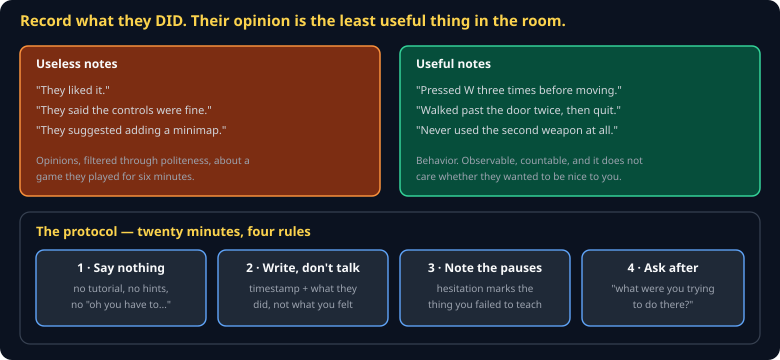

# Playtesting Cheat Sheet (80/20)

How to run a twenty-minute session that produces evidence instead of compliments. This is the rubric your `playtest-evidence` submission is graded against, so the protocol below is worth following literally.

Companion to [`mda-framework`](mda-framework.md) and [`theory-of-fun`](theory-of-fun.md).



## The core problem

Your tester is a person who likes you and does not want to be rude. Ask them what they thought and you will get a filtered, polite summary of a six-minute experience.

> **Record what they did. Their opinion is the least reliable data in the room.**

"They liked it" is unusable. "Pressed W three times before the character moved" is a bug report, a design note, and a priority all at once.

## The four rules

**1 · Say nothing.** No tutorial, no hints, no "oh, you have to press E there." The instant you explain something, you have destroyed the only chance you had to find out whether the game explains it. Sit on your hands. It is genuinely hard.

**2 · Write, do not talk.** Timestamp and behavior:

```
0:14  clicked the HUD twice — expected it to be a button
0:31  walked past the door, came back, walked past again
1:05  died. said "what killed me?"
2:40  never picked up the second weapon
```

**3 · Note every pause.** Hesitation is the signal. A three-second pause means the game asked a question the player could not answer — and that is exactly where your design is unclear.

**4 · Ask afterwards, and ask about intent.** Not "did you like it?" but:

- "What were you trying to do there?"
- "What did you expect that button to do?"
- "When you died, did you know why?"

That last one is straight from Koster: if they cannot say why they died, you shipped noise rather than difficulty.

## What to look for

| Observation | Usually means |
|---|---|
| Repeats an input | No feedback that it registered |
| Walks past the objective | It does not read as an objective |
| Never uses a mechanic | It is not discoverable, or it is not worth using |
| Dies and looks confused | Untelegraphed — noise, not difficulty |
| Stops playing | You found your ceiling. Note the timestamp. |

## Three testers is enough

You do not need a study. Three outside testers catch most of what one round can catch, and the second and third confirm whether the first was an outlier. **They must be people who did not build it** — your teammates have learned the game and cannot un-learn it.

## Translating to a fix

Run the observation back through MDA. A tester saying "the boss is unfair" plus your note "died 4 times, never dodged the slam" points at wind-up duration, not boss health.

**Players report problems accurately and propose solutions badly.** Take the observation; discard the patch.

## What to submit

Per the rubric: who played, what you observed with timestamps, and **one specific change you made because of it**, linked to the observation that prompted it. A playtest that changed nothing was a demo.

## Common gotchas

- **Helping.** The single most common failure, and it invalidates the session.
- **Testing with teammates only.** They know where the door is.
- **Recording opinions.** "They said it was fun" tells you nothing you can act on.
- **Testing too late.** A playtest in the last week is a bug hunt, not design feedback.
- **Fixing everything one tester said.** Three testers hitting the same wall is a signal; one is a data point.

## When you're stuck

- Watch a stranger play for five minutes with your hands physically in your lap. It is the whole technique.
- [`mda-framework`](mda-framework.md) — for translating what you saw into what to change
- If nobody is available, record yourself playing a build you have not touched in a week. It is a weak substitute, and still better than nothing.
