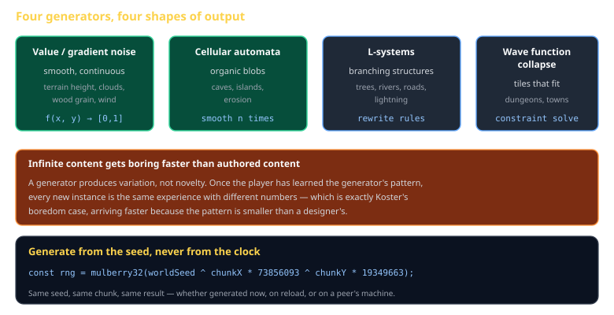
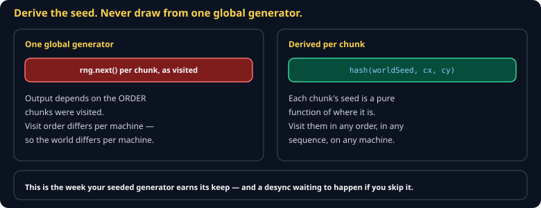

# Procedural Generation Cheat Sheet (80/20)

Four generators that cover most of what a game needs — noise, cellular automata, L-systems, and wave function collapse — plus the determinism rule that makes any of them usable in a multiplayer game. Skips Perlin's mathematical details and full constraint solvers.

Companion to [`determinism-and-replay`](determinism-and-replay.md) and [`theory-of-fun`](theory-of-fun.md). Specified in `spec/S14-procedural-generation.md`.



## The rule that comes first



> **Generate from the seed, never from the clock or call order.**

```js
const rng = mulberry32(worldSeed ^ Math.imul(chunkX, 73856093) ^ Math.imul(chunkY, 19349663));
```

Deriving each chunk's seed from the world seed and its coordinates means chunk (5, 3) generates identically whether it is produced now, after a reload, or on a peer's machine. Drawing sequentially from one global generator means the result depends on the *order* chunks were visited — which is a desync waiting to happen.

## Value noise

Smooth, continuous, cheap. Terrain heights, cloud cover, wind:

```js
function valueNoise2D(x, y, rng) {
  const x0 = Math.floor(x), y0 = Math.floor(y);
  const fx = smoothstep(x - x0), fy = smoothstep(y - y0);
  const a = hash2(x0, y0), b = hash2(x0 + 1, y0);
  const c = hash2(x0, y0 + 1), d = hash2(x0 + 1, y0 + 1);
  return lerp(lerp(a, b, fx), lerp(c, d, fx), fy);
}
const smoothstep = (t) => t * t * (3 - 2 * t);
```

**Octaves** are where it starts looking real — sum several frequencies, each at half the amplitude:

```js
let value = 0, amp = 1, freq = 1;
for (let o = 0; o < 4; o++) { value += valueNoise2D(x * freq, y * freq) * amp; amp *= 0.5; freq *= 2; }
```

One octave is rolling hills. Four is terrain.

## Cellular automata

The best caves-and-islands generator for the effort:

```js
let grid = fill((x, y) => (rng() < 0.45 ? WALL : FLOOR));
for (let step = 0; step < 5; step++) {
  grid = map(grid, (x, y) => (countWalls(grid, x, y, 1) >= 5 ? WALL : FLOOR));
}
```

Random noise, then five smoothing passes. The result looks hand-carved. **Always flood-fill afterwards** and discard or connect disconnected regions — an unreachable treasure room is the classic procgen bug.

## L-systems

Rewrite rules producing branching structures — trees, rivers, road networks, lightning:

```
axiom: F
rule:  F → F[+F]F[-F]F
```

`F` draws forward, `[` and `]` push and pop position, `+` and `-` turn. Apply the rule four times and interpret the string with a turtle.

## Wave function collapse

Tiles plus adjacency constraints: repeatedly pick the least-constrained cell, choose a legal tile, propagate. Excellent for dungeons and towns that must obey rules ("a door tile needs a wall on both sides").

Expensive and prone to contradictions. Keep the tile set small, and be prepared to restart with the next seed when it paints itself into a corner.

## The design warning

> **Infinite content gets boring faster than authored content.**

A generator produces *variation*, not *novelty*. Once the player has learned its pattern — and a generator's pattern is smaller than a designer's — every new instance is the same experience with different numbers.

The fix is hybrid: generate the space, author the moments. Procedural terrain with hand-placed landmarks beats either alone.

## Common gotchas

- **Drawing from a shared global RNG.** Generation order becomes part of the output. Derive per-chunk seeds.
- **No connectivity check.** Unreachable rooms, isolated islands, sealed caves.
- **Floats in the seed derivation.** Use integer hashing; float rounding differs across platforms.
- **Generating on the fly during a tick.** Expensive and it stalls the frame. Generate on load or on a worker.
- **No way to reproduce a bug.** Log the seed. Always log the seed.

## When you're stuck

- [Red Blob Games](https://www.redblobgames.com/) — noise, maps, and grids, all interactive
- `spec/S14-procedural-generation.md` — the class specification
- Render the raw generator output as a greyscale image before building anything on top. Most procgen bugs are obvious as a picture and invisible as numbers.
