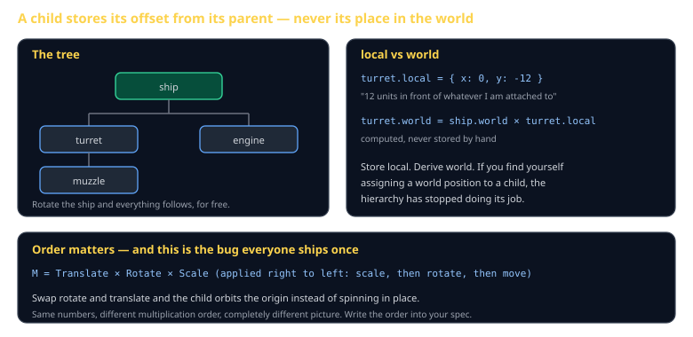
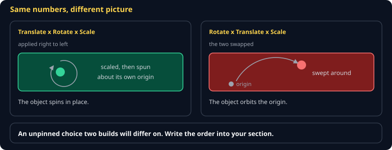

# Scene Graph and Transforms Cheat Sheet (80/20)

Parent-child transforms in the 20% you need for both 2D and 3D: local versus world, the multiplication order that trips everyone once, and how to walk the tree without recomputing everything. Skips quaternions and dual quaternions — Euler angles and matrices carry you through this course.

Companion to [`2d-rendering`](2d-rendering.md) and [`3d-rendering-webgl`](3d-rendering-webgl.md). Specified in `spec/S04-transform-hierarchy.md`.



## The one rule

> **A child stores where it is relative to its parent. Never where it is in the world.**

A turret is "12 units in front of the ship." Rotate the ship and the turret follows, because its stored position never described the world in the first place.

The moment you assign a world position to a child, the hierarchy stops working and you are back to updating every part by hand.

## Local, world, and how you get from one to the other

```js
// stored on the node
node.local = { x: 0, y: -12, rot: 0, scale: 1 };

// derived, every frame, top-down
function updateWorld(node, parentWorld) {
  node.world = multiply(parentWorld, toMatrix(node.local));
  for (const child of node.children) updateWorld(child, node.world);
}
updateWorld(root, IDENTITY);
```

Parents must be computed before children, so walk the tree top-down. If you iterate a flat list in arbitrary order, half your nodes use last frame's parent matrix and everything lags by one frame in a way that looks like input latency.

## Multiplication order



```
M = Translate × Rotate × Scale
```

Applied right to left: scale first, then rotate, then translate. Swap rotate and translate and the object **orbits the origin** instead of spinning in place — same numbers, completely different picture.

This is worth stating in your spec explicitly, because it is exactly the kind of unpinned choice that makes two correct-looking implementations disagree.

## 2D is 3D with a column removed

A 2D affine transform is a 3×3 matrix; a 3D one is 4×4. The mental model is identical, which is why doing 2D properly in Tier 1 makes Tier 3 mostly a matter of adding a dimension.

```js
// 2D: [a c tx]      3D: the same, with z and a fourth row
//     [b d ty]
//     [0 0  1]
```

## Dirty flags, when you need them

Recomputing every world matrix every frame is fine at a few thousand nodes. When it is not:

```js
node.dirty = true;              // set when local changes, propagate down
if (!node.dirty && !parentChanged) return node.world;   // reuse
```

Reach for it when profiling says the transform walk is hot — not before. A dirty flag that is set incorrectly produces objects that visibly refuse to move, which is a worse bug than a slow frame.

## Common gotchas

- **Reading `world` before the walk has run this frame.** You get last frame's value. Order your systems.
- **Non-uniform scale plus rotation.** Produces shear. If a rotated child looks skewed, this is why.
- **Deep hierarchies.** Every level is another matrix multiply per node per frame. Three or four levels is plenty.
- **Detaching without preserving world position.** Removing a child usually should keep it where it visually is — compute its world transform, then re-express it as local to the new parent.
- **Storing rotation in degrees in some places and radians in others.** Pick one, name it in the spec, and never convert silently.

## When you're stuck

- [Matrices for game developers](https://gameprogrammingpatterns.com/) and any linear-algebra primer for the 4×4 case
- `spec/S04-transform-hierarchy.md` — the class specification
- Draw the parent's axes on screen for one frame. Most transform bugs are immediately obvious once you can see which way the parent thinks "up" is.
