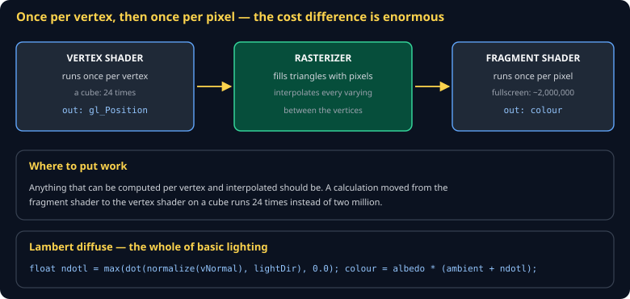

# Shaders and Materials Cheat Sheet (80/20)

GLSL in the parts you need to light a mesh and tint a sprite: the two stages, uniforms versus attributes versus varyings, and Lambert diffuse. Skips PBR, normal mapping, and compute shaders.

Companion to [`3d-rendering-webgl`](3d-rendering-webgl.md).



## The two stages

A **vertex shader** runs once per vertex and must output `gl_Position`. A **fragment shader** runs once per pixel and must output a colour. Between them the rasterizer interpolates.

The cost asymmetry is the thing to internalize: a cube has 24 vertices and can cover two million pixels. Work moved from fragment to vertex gets ~80,000× cheaper.

## The three kinds of input

| Kind | Changes | Example |
|---|---|---|
| `uniform` | per draw call | the MVP matrix, a light direction, time |
| `in` (attribute) | per vertex | position, normal, UV |
| `out`/`in` (varying) | interpolated per pixel | the normal, passed from vertex to fragment |

```glsl
#version 300 es
in vec3 aPosition;
in vec3 aNormal;
uniform mat4 uMvp;
uniform mat3 uNormalMatrix;
out vec3 vNormal;

void main() {
  vNormal = uNormalMatrix * aNormal;
  gl_Position = uMvp * vec4(aPosition, 1.0);
}
```

```glsl
#version 300 es
precision highp float;              // REQUIRED in fragment shaders, or it will not compile
in vec3 vNormal;
uniform vec3 uLightDir;
uniform vec3 uAlbedo;
out vec4 outColour;

void main() {
  float ndotl = max(dot(normalize(vNormal), normalize(uLightDir)), 0.0);
  outColour = vec4(uAlbedo * (0.2 + 0.8 * ndotl), 1.0);
}
```

That is a complete, correct lit material. Everything else is refinement.

## Why normals need their own matrix

Transforming a normal by the model matrix is wrong under non-uniform scale — the normal ends up no longer perpendicular to the surface. Use the inverse transpose of the upper-left 3×3:

```js
const normalMatrix = transpose(inverse(mat3(model)));
```

Symptom of getting it wrong: lighting that is subtly incorrect only on stretched objects.

## Normalize in the fragment shader

Interpolating two unit vectors does not produce a unit vector. Always `normalize(vNormal)` in the fragment shader, never rely on the vertex shader's normalization surviving interpolation.

## A material

A material is a shader program plus its uniform values. Group draws by program — switching programs is one of the more expensive things you can do per frame:

```js
for (const [program, meshes] of byProgram) {
  gl.useProgram(program);
  setSharedUniforms(program);          // camera, lights — once
  for (const mesh of meshes) { setPerMeshUniforms(mesh); draw(mesh); }
}
```

## Common gotchas

- **No `precision` line in the fragment shader** — will not compile, and the error is easy to miss.
- **Not checking `getShaderInfoLog`.** A failed compile gives you a black screen and no exception. Always check.
- **Attribute location mismatch** — the name in JS must match the shader exactly, and it is case-sensitive.
- **Forgetting to normalize an interpolated vector** — lighting that is bright in the middle of a face and dark at the edges.
- **Integer division in GLSL** — `1 / 2` is `0`. Write `1.0 / 2.0`.
- **Uniforms set before `useProgram`.** Silently discarded.

## When you're stuck

- [The Book of Shaders](https://thebookofshaders.com/) — for fragment shaders specifically
- [WebGL2 Fundamentals](https://webgl2fundamentals.org/) — for the pipeline around them
- Output a debug colour: `outColour = vec4(normalize(vNormal) * 0.5 + 0.5, 1.0)`. If the normals look wrong, everything downstream is.
