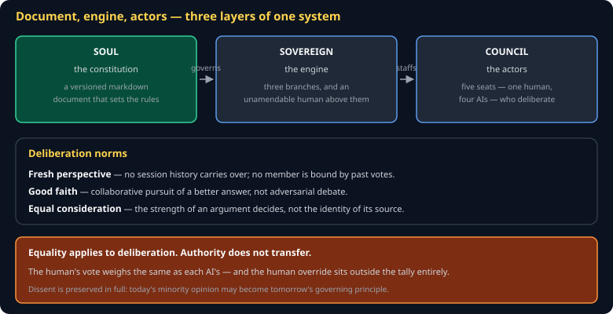
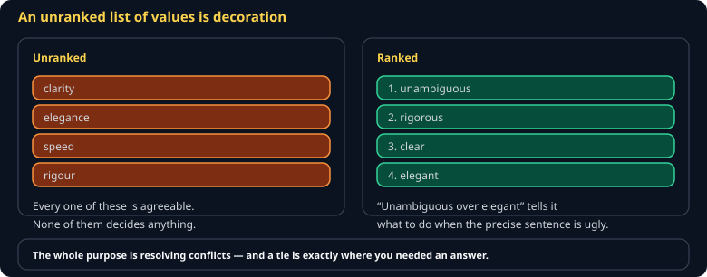
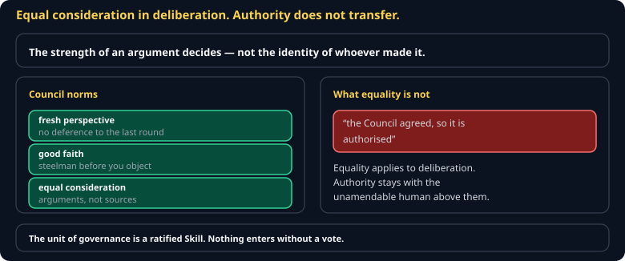
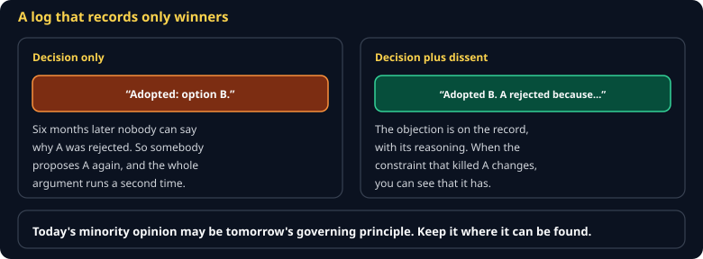

# Soul, Sovereign, and Council Cheat Sheet (80/20)

Giving an agent a point of view, and getting a decision out of several of them. Covers writing a soul that changes behavior, the three-branch structure, and running a council in an afternoon.

Companion to [`cc-hooks`](cc-hooks.md) and [`cc-subagents-and-archetypes`](cc-subagents-and-archetypes.md).



## The one-sentence version

A **Soul** is a written constitution. The **Sovereign Framework** is the machine that enforces it. The **Council** is the panel that deliberates and votes inside it.

## Why an agent needs one

> **An agent without a defined point of view drifts toward the average of its training data — helpful, generic, aligned with no one in particular.**

That is fine for a one-off question and inadequate for anything acting on your behalf repeatedly. A soul is how you say what "good" means for *this* project.

## Writing one

```markdown
# SOUL — CS 3540 engine spec

## Identity
We maintain a specification that independent agents build from. We exist so
that two builds of the same document produce the same engine.

## Values (RANKED — order matters in conflict)


1. Unambiguous over elegant
2. Implementable in a second language over idiomatic
3. Explicit over implicit
4. Small over complete
5. Honest about gaps over confident

## Voice
We sound precise and plain. We never sound clever at the reader's expense.

## Non-negotiables
We never edit a conformance vector to make a build pass.
We always name the rounding, units, ordering, and tie-break.

## Escalation
Stop and ask a human when: a section's builds disagree twice in a row,
or a change would alter a published tag.
```

**Rank the values.** An unranked list is decoration — the whole purpose is resolving conflicts, and a conflict is precisely where you need to know which one wins. "Unambiguous over elegant" tells an agent what to do when a precise sentence is ugly.

## Deploying it

```bash
claude -p "review spec/S11" --append-system-prompt "$(cat SOUL.md)"
```

Or paste it at the top of a subagent definition, which persists it.

Use `--append-system-prompt`, not `--system-prompt`. The latter *replaces* everything, including safety guidance.

## The Sovereign Framework

Three branches under an unamendable human:

| Branch | Does | Cannot |
|---|---|---|
| **Executive** — the Directorate | Interpret intent, route, propose. Acts with speed. | Legislate |
| **Legislative** — the Assembly | Deliberate and ratify new capabilities | Execute unilaterally |
| **Judicial** — the Review | Review actions for alignment, before and after | Block without constitutional basis |

**The Sovereign is always human.** The Right to Override — halting or reversing any action regardless of consensus — sits outside the process entirely.

The unit of governance is a **Skill**: no capability enters the system without a vote. Proposed → Active → Suspended → Archived.

## Running a council



You do not need the full framework to get the value:

1. **Convene.** One real decision, three subagents dispatched in a single turn — a cautious seat, a pragmatic seat, and a contrarian seat.
2. **Deliberate.** Each returns a position with reasoning and a confidence score.
3. **Reconcile.** The main loop tallies, synthesizes one ruling, and **records the dissent**.
4. **Precedent.** Append the ruling to a file so the system accumulates case law instead of relitigating.

UVU's AI Gateway is useful here — ChatGPT, Claude, Gemini, and Copilot under one login gives you genuinely different vendors rather than one model roleplaying three positions.

## Why recorded dissent matters



> **Today's minority opinion may become tomorrow's governing principle.**

A decision log that records only the winner cannot tell you *why* an option was rejected — so the same argument gets relitigated every quarter, badly. Preserving dissent is what makes the record worth keeping.

## The pattern underneath

Independent perspectives → adversarial review → supermajority synthesis → recorded precedent.

That is Pillar 4 fan-out with a constitution attached. And it is the same shape as this course's divergence metric: independent builds, compared, with disagreement treated as information rather than failure.

## Declined versus blocked

The soul makes the agent **want** to behave — probabilistic, persuadable in principle. The hook makes misbehavior **impossible** — deterministic, cannot be sweet-talked. Least privilege makes the residue survivable; the audit trail makes it explainable.

> **If it must happen, hook it. If it is a judgment call, give it a soul.**

## Common gotchas

- **Unranked values.** Useless exactly when needed.
- **`--system-prompt` instead of `--append-system-prompt`.** You removed the safety guidance.
- **A soul nobody deployed.** A markdown file changes nothing on its own.
- **A council of one model wearing hats.** Correlated failure modes — the whole point is independence.
- **Discarding dissent.** You will have the same argument again in six weeks.
- **Treating a soul as a security control.** It is a judgment control. Security is hooks and least privilege.

## When you're stuck

- [give-your-ai-a-soul.netlify.app](https://give-your-ai-a-soul.netlify.app) — the Soul Builder
- [sovereign-framework-explainer.netlify.app](https://sovereign-framework-explainer.netlify.app) — the framework in full
- Test a soul by asking the agent to do something it forbids. If it complies, the soul is decoration.
