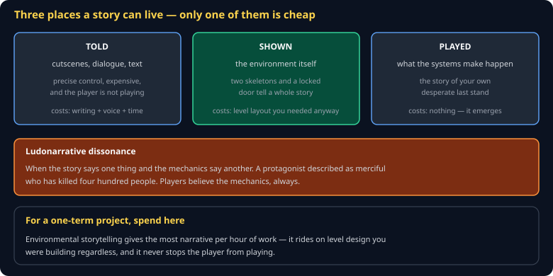
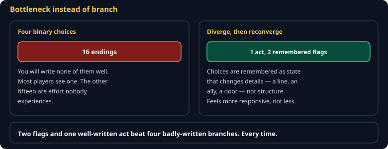
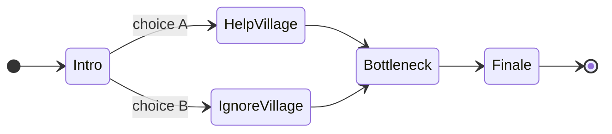

# Storytelling in Games Cheat Sheet (80/20)

Where a story can live, why the cheapest option is usually the best one for a one-term project, and how to structure branching without writing 2^n endings. Skips screenwriting craft — this is about the parts unique to an interactive medium.

Companion to [`cutscenes-and-timelines`](cutscenes-and-timelines.md) and [`theory-of-fun`](theory-of-fun.md). Specified in `spec/S15-narrative.md`.



## The three modes

**Told** — cutscenes, dialogue, journals. Precise control, and the most expensive per minute of experience. It also stops the player from playing, which is the one thing your medium does that others cannot.

**Shown** — the environment. Two skeletons beside a door barred from the inside is a complete story, and it costs level layout you were building anyway.

**Played** — what emerges from the systems. The player's account of their own desperate last stand is the most memorable story your game will produce, and you did not write a word of it.

> **For a one-term project, spend almost everything on *shown*.** It has the best narrative-per-hour ratio and it never interrupts play.

## Ludonarrative dissonance

When the story says one thing and the mechanics say another.

The canonical case: a protagonist described as reluctant and merciful who has, by the credits, killed four hundred people. The mechanics said "killing is how you progress" for twelve hours. The cutscene said otherwise for two minutes.

> **Players believe the mechanics.** They are what the player *did*; the story is what the game *claimed*.

So check: does your resource system say scarcity while your drops say abundance? Does your story say "you are being hunted" while the player can safely stand still?

## Branching without exploding



Every binary choice doubles the endings. Four choices is sixteen branches, and you will write none of them well.

**Bottleneck instead.** Branches diverge, then reconverge. The choices are remembered as *state*, and they change details rather than structure:



At the Finale, `helpedVillage` decides whether allies arrive — not whether an entirely different act was written. Two flags, one act, a story that felt responsive.

## Dialogue as data

```json
{ "id": "guard_gate",
  "lines": [
    { "speaker": "guard", "text": "The gate is sealed." },
    { "speaker": "guard", "text": "Not since the flood.", "if": "askedAboutFlood" }
  ],
  "choices": [
    { "text": "Who sealed it?",  "goto": "guard_who" },
    { "text": "I have the key.", "goto": "guard_key", "if": "hasKey" }
  ] }
```

Data, not code. It is editable without a rebuild, translatable, testable, and — critically for this course — a chosen line enters the simulation as a **command**, which is what keeps a conversation replayable.

## LLM dialogue, honestly

A language model can generate NPC lines at runtime, and the requirement to use one is real. Two constraints make it work:

1. **Record the reply into the command log.** The model is nondeterministic; the recorded reply is not. Replay reads the log, never the model.
2. **Constrain the output.** A small local model returns something usable when you demand a shape:

```json
{ "line": "...", "emotion": "wary", "revealsSecret": false }
```

Free-form prose from a 3B model wanders. A JSON schema with three fields does not.

And keep authored fallback lines. When the provider is unreachable, the conversation must still happen — that is a graded conformance vector.

## Mystery

Mystery is a pattern the player is invited to complete. It works when there is genuinely something to find and the clues are fair. It fails when the answer does not exist, or when it was never discoverable — at which point it is not mystery, it is noise, and players can tell the difference within an hour.

## Common gotchas

- **A cutscene the player cannot skip.** See [`cutscenes-and-timelines`](cutscenes-and-timelines.md).
- **Exponential branching.** Bottleneck.
- **Story in a journal nobody reads.** If it matters, it must be shown or played.
- **Mechanics contradicting the theme.** Players believe the mechanics.
- **LLM dialogue that is not recorded.** Breaks replay and desyncs multiplayer.
- **A mystery with no answer.** Noise.

## When you're stuck

- Play a level of a game you admire with the sound off and read what the environment says. That is environmental storytelling, isolated.
- `spec/S15-narrative.md` — the class specification
- If a story beat feels flat, ask whether the player *did* anything during it. If not, that is usually the problem.
