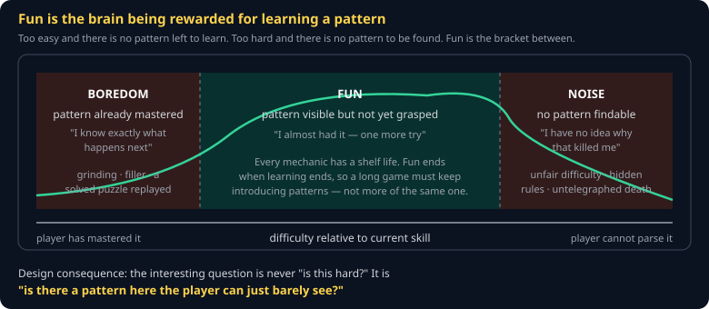
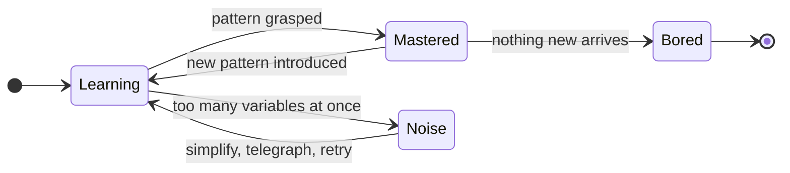

# Theory of Fun Cheat Sheet (80/20)

Raph Koster's argument in the 20% you will actually use when designing a game: what fun *is*, why every mechanic expires, and what that means for your difficulty curve. Skips the anthropology chapters — read the book for those; it takes an evening and is half pictures.

Companion to [`difficulty-and-flow`](difficulty-and-flow.md) and [`mda-framework`](mda-framework.md).

## The claim

> **Fun is the feeling of your brain successfully learning a pattern.**

That is not a metaphor about games. It is a claim about why games are pleasurable at all: they are pattern-recognition exercises with the boring parts removed, and the pleasure is the reward signal for successful learning.

Three consequences follow immediately, and they are the whole practical value of the book.

## Consequence 1: every mechanic has a shelf life

Once the pattern is fully learned, the reward stops. The player has not become jaded — they have **finished learning**, and your mechanic has nothing left to teach.

This is why "more of the same, but bigger numbers" stops working, and why a game that felt brilliant for two hours can feel like a chore at ten. You did not run out of content. You ran out of *pattern*.

**What to do:** plan when each mechanic expires, and what arrives to replace it. A new enemy that must be fought differently extends the game. A new enemy with more health does not.

## Consequence 2: noise is not difficulty

If the player cannot find the pattern at all, there is nothing to learn, and the experience is not hard — it is **noise**. It feels unfair, because it is.

| Reads as difficulty | Reads as noise |
|---|---|
| A telegraphed attack you must learn to dodge | An attack with no wind-up |
| A boss with a visible pattern | A boss whose behavior is randomized |
| Losing because you were too slow | Losing to a rule you were never shown |

**The test:** after a death, can the player say *why* they died? If not, you have shipped noise. This is what telegraphing, wind-up animations, and readable silhouettes are actually for — they are not polish, they are what makes the pattern learnable.

## Consequence 3: the curve must track skill, not clock

Difficulty is meaningful only relative to the player's *current* skill, which is rising as they play. A flat difficulty curve therefore slides into boredom on its own.

The two exits from `Mastered` are the entire job of a level designer.

## Using it on your own game

Ask these four questions about your core loop. They are worth more than any amount of theory.

1. **What is the pattern the player is learning?** If you cannot say it in one sentence, neither can they.
2. **How long until they have learned it?** Be honest — usually less time than you think.
3. **What arrives next?** If nothing does, that is where your game ends, regardless of how much content remains.
4. **When they lose, do they know why?** If not, you have a noise problem wearing a difficulty costume.

## Where Koster overreaches

The book claims games are *nothing but* pattern learning. That is too strong. It does not account well for story, for social play, or for the pleasure of a beautiful space — and Koster acknowledges as much in the margins.

Treat it as a sharp tool for one dimension of design rather than a unified theory. It explains why grinding stops being fun. It does not explain why anyone cries at the end of a game.

## Common gotchas

- **Confusing "hard" with "fun."** Difficulty is a lever, not a goal. The target is *learnable*, and hard is one way to get there.
- **Adding content instead of patterns.** Twenty levels of the same mechanic is one mechanic played twenty times.
- **Tutorializing the pattern away.** If you explain it, the player does not get to learn it, and you have spent the reward on their behalf.
- **Randomness where the player expects a rule.** Variance is not the same as depth; it converts learnable patterns into noise.

## When you're stuck

- Raph Koster, *A Theory of Fun for Game Design*, 10th Anniversary Edition — the whole argument, in an evening
- [Koster's slides and talks](https://www.raphkoster.com/games/presentations/) — the same material, compressed
- Play a game you loved and stopped playing. Write down the sentence describing the pattern you finished learning. That exercise teaches this faster than the book does.
