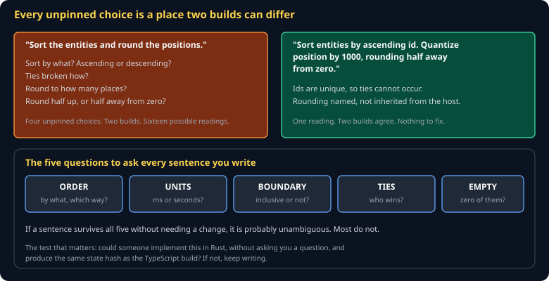

# Writing a Spec Agents Can Build Cheat Sheet (80/20)

How to write prose precise enough that two independent implementations agree — which is the skill this course grades your section on, and the one that does not exist in most engineering curricula.

Companion to [`conformance-vectors`](conformance-vectors.md) and [`ai-sdlc-spec-driven`](ai-sdlc-spec-driven.md).



## The standard

> **Two agents, no conversation, same document. Do they build the same thing?**

That is testable, and this course tests it. It is a much higher bar than "a reasonable person would understand this," because a reasonable person asks a follow-up question and an independent build does not.

## The five questions

Ask these of every sentence. They catch most real ambiguity.

| Question | Sounds fine | Actually says |
|---|---|---|
| **Order?** | "sort the entities" | by id? by creation? ascending? |
| **Units?** | "after 50" | milliseconds, seconds, ticks, frames? |
| **Boundary?** | "positive health" | is exactly 0 alive? |
| **Ties?** | "the nearest enemy" | two at equal distance — which? |
| **Empty?** | "the average damage" | of zero attacks — 0, null, or an error? |

The empty case is the one most often missed and most often crashes.

## Pin the things languages disagree about

These are not pedantry. Each has produced a real bug in this repo.

- **Rounding.** `Math.round(-0.5)` is `-0` in JavaScript; Dart's `(-0.5).round()` is `-1`. Say **"round half away from zero"**, never "round."
- **Sort stability.** `Array.prototype.sort()` is stable in modern JS and was not always. If ties matter, break them explicitly.
- **Integer division.** `7 / 2` is `3.5` in JS, `3` in Rust. Say "floor divide" if you mean floor.
- **String comparison.** Locale-aware collation differs by platform. Say "byte order" if that is what you mean.
- **Iteration order.** Say "ascending id," never "in order," and never rely on a map's order.

## Structure that works

```markdown
# S09 — The 2D Renderer

**Owner:** ... · **Status:** ... · **Depends on:** S00, S04

## Claim
One sentence. What is true when this section is implemented correctly?

## Invariants
Numbered. Things that must always hold.

## Behavior
What happens, in what order, with the units named.

## Acceptance criteria
Concrete, checkable statements — the seed of your vectors.

## Vectors
Links to the conformance vectors that assert the above.
```

The **Claim** first is not decoration. If you cannot write it in one sentence, the section is doing two jobs and should be two sections.

## Say what is NOT true

Non-goals are load-bearing. An agent told "render sprites" may helpfully implement z-ordering, batching, and a particle system, none of which you specified and all of which will diverge.

```markdown
## Non-goals
- No z-ordering. Draw order is submission order.
- No batching. One draw call per sprite is acceptable at this tier.
```

## The second-language test

> **Could someone implement this in Rust, without asking you anything, and get the same state hash?**

This is the guard against the most common failure: writing TypeScript and calling it a specification. If your section leans on a language feature — how JS coerces, what `undefined` does, the behavior of a specific library — an implementer in another language cannot follow it, and neither can an agent that chose a different idiom.

A useful smell: count your code blocks. More than two or three in a section, and you are probably specifying an implementation.

## Reading your divergence report

When builds disagree on your section, resist explaining why the disagreeing build was wrong. It read your words and did something permitted by them. Find the sentence that permitted it and pin it.

The revision is usually small — one clause naming an order, a unit, or a boundary. The hard part is finding it, which is exactly what the report does for you.

## Common gotchas

- **"Obviously" and "simply."** Both mean "I did not check whether this is stated."
- **Describing the happy path only.** The error case is where implementations diverge most.
- **Using an example instead of a rule.** One worked example plus a rule is excellent; an example alone gets generalized differently by different readers.
- **Passive voice hiding the actor.** "The entity is updated" — by whom, in what order, relative to what else?
- **Specifying performance without a number.** "Fast" is not checkable. "5,000 bodies at 60fps" is.

## When you're stuck

- `spec/S00-overview.md` through `S03` — four worked examples, including two ambiguities found the hard way
- Hand your section to a classmate and ask them to describe what they would build. Where their description surprises you, that is the sentence.
- Run the five questions over one paragraph. If nothing changes, you have written a good paragraph — which is rarer than it sounds.
